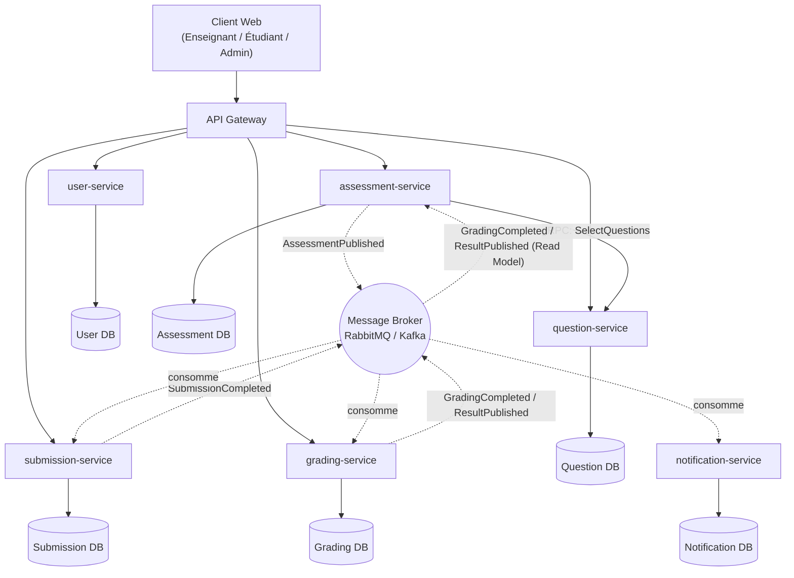
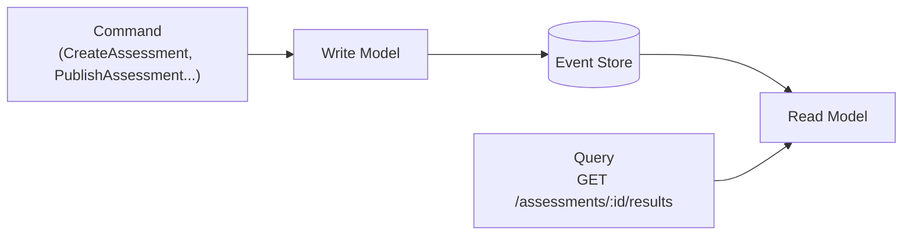

# Architecture — Plateforme de gestion des évaluations

## Vue d'ensemble



- **Traits pleins** : communication synchrone (REST via l'API Gateway, gRPC
  entre `assessment-service` et `question-service`).
- **Traits pointillés** : communication asynchrone via le broker de
  messages (publication/consommation d'événements).
- **Bases de données** : une base par service, aucune base partagée.

## Flux principal (parcours nominal)

1. L'enseignant crée des questions (`question-service`, REST).
2. L'enseignant crée une évaluation ; en génération automatique,
   `assessment-service` appelle `question-service` en **gRPC**
   (`SelectQuestions`).
3. L'enseignant publie l'évaluation → `assessment-service` publie
   `AssessmentPublished` sur le broker.
4. `submission-service` consomme l'événement et ouvre l'accès à
   l'évaluation pour les étudiants inscrits.
5. L'étudiant réalise l'évaluation et soumet ses réponses (REST) →
   `submission-service` publie `SubmissionCompleted`.
6. `grading-service` consomme l'événement, effectue la correction
   automatique puis publie `GradingCompleted`.
7. Pour les questions ouvertes, l'enseignant complète la correction
   manuelle via `grading-service` (REST), puis publie `ResultPublished`.
8. `notification-service` consomme tous les événements ci-dessus et
   notifie les utilisateurs concernés.

## Saga : Soumission → Correction → Notification

Modèle **chorégraphié** : chaque service réagit aux événements sans
coordinateur central (cohérent avec le faible nombre de services et
l'objectif pédagogique de montrer le couplage faible par événements).

```
SubmissionCompleted → grading-service (correction auto)
                          │
                          ▼
                  GradingCompleted / ResultPublished
                          │
                          ▼
                  notification-service (notifie l'étudiant)
```

**Compensation** : si la correction automatique échoue ou si la
soumission arrive hors délai, `submission-service` déclenche
`AnnulerSoumission` et `grading-service` ne produit pas de note ; l'état
reste consultable par l'enseignant pour intervention manuelle
(`RouvrirCorrection`).

## CQRS + Event Sourcing (assessment-service)



- **Write Model** : traite les commandes, valide les règles métier
  (ex. impossible de publier une évaluation sans questions).
- **Event Store** : conserve l'historique des événements
  (`AssessmentCreated`, `AssessmentPublished`, `AssessmentClosed`...).
- **Read Model** : reconstruit à partir des événements, optimisé pour la
  consultation des résultats par l'enseignant et l'étudiant.

## Contrats d'API

Voir `docs/openapi/` (à compléter au Sprint 1) pour les spécifications
OpenAPI/Swagger de chaque service REST.
